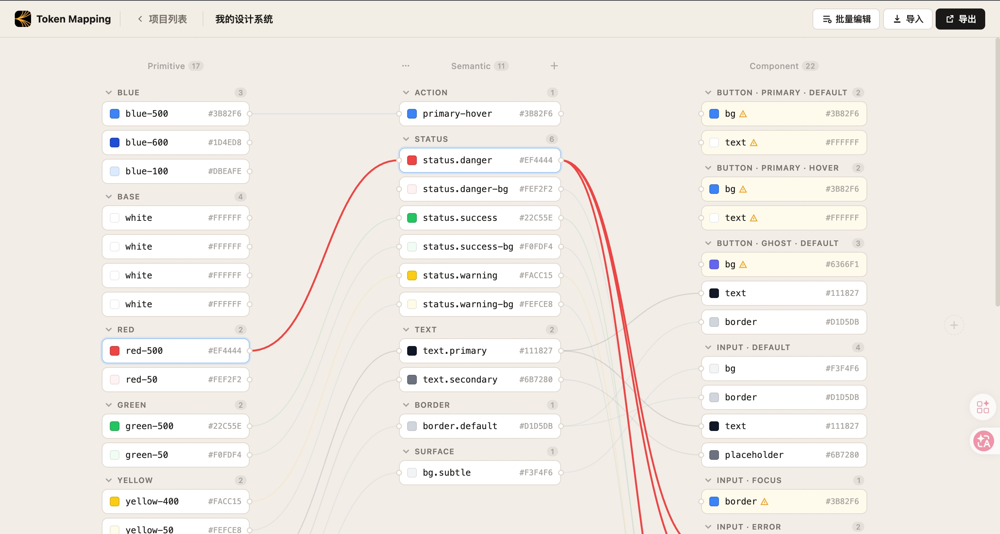
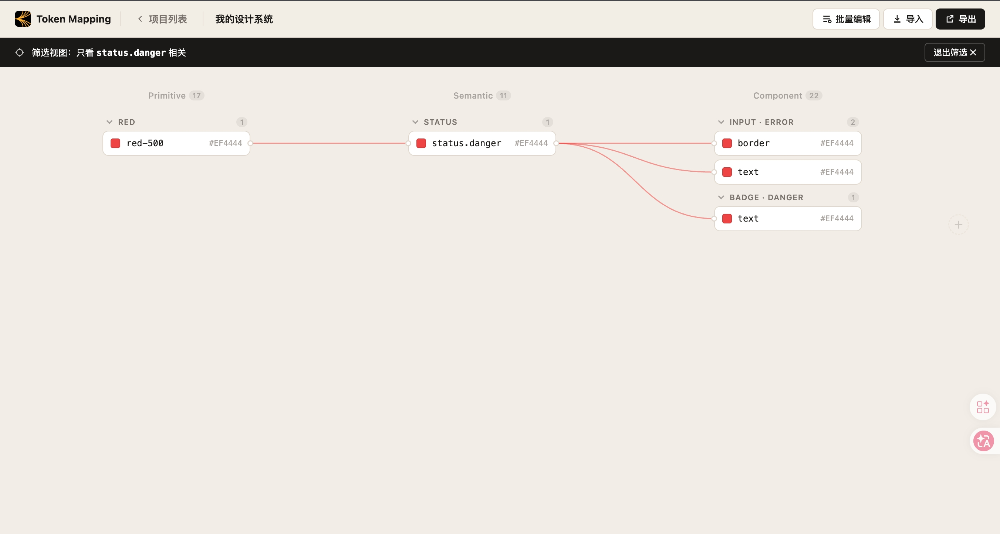
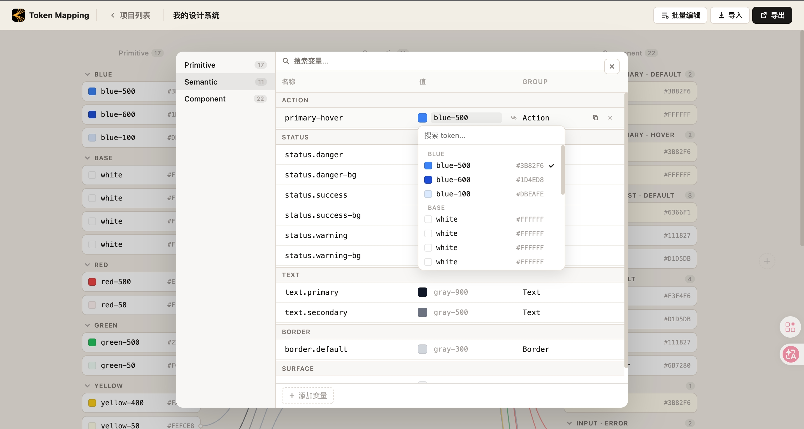

# Token Mapping

**中文** | [English](#english)

Token Mapping 是一个轻量级设计 Token 映射平台，用于在多个 Collection 之间组织变量，并把 Primitive、Semantic、Component 等不同层级的 Token 关系可视化串联起来。

它采用浏览器优先的单页应用形态，后端使用 Express 提供静态服务和运行时配置接口，用户认证与数据持久化由 Supabase 提供。

## 界面预览

### Token 映射总览



### 相关 Token 筛选视图



### 批量编辑器



## 功能特性

- 按用户管理多个 Token Mapping 项目。
- 创建、重命名和删除 Token Collection。
- 添加带分组、色值和上游引用关系的变量。
- 通过可视化连线查看 Token 之间的映射关系。
- 聚焦单个 Token，只查看相关的上游与下游映射。
- 使用批量编辑器高效维护变量名称、分组和值。
- 支持导入 JSON 数组、Token Studio / W3C DTCG 风格嵌套 JSON、Figma 变量导出结构和 CSS 变量。
- 导出映射后的 `tokens.json`。
- 通过 Supabase Row Level Security 保护用户项目和映射数据。

## 技术栈

- Node.js
- Express
- Vanilla HTML, CSS, JavaScript
- Supabase Auth 与 Postgres

## 项目结构

```text
.
├── index.html       # 应用页面与 UI 结构
├── main.js          # Token 编辑、导入导出、Supabase 逻辑
├── style.css        # 应用样式
├── server.js        # Express 服务与运行时配置接口
├── schema.sql       # Supabase 数据表与 RLS 策略
├── .env.example     # 环境变量模板
└── logo.png
```

## 本地运行

安装依赖：

```bash
npm install
```

创建本地环境变量文件：

```bash
cp .env.example .env
```

在 `.env` 中填写 Supabase 配置：

```env
SUPABASE_URL=https://your-project-ref.supabase.co
SUPABASE_ANON_KEY=your-publishable-or-anon-key
PORT=3000
```

启动应用：

```bash
npm run dev
```

打开：

```text
http://localhost:3000
```

如果没有设置 `PORT`，服务会默认运行在 `55872`。

## Supabase 配置

1. 创建 Supabase 项目。
2. 打开 Supabase SQL Editor。
3. 执行 `schema.sql` 中的 SQL。
4. 启用需要的 OAuth 登录方式：
   - GitHub
   - Google
5. 配置本地开发用的认证 URL：
   - Site URL: `http://localhost:3000`
   - Redirect URL: `http://localhost:3000`

数据库结构包含：

- `projects`：每个用户拥有的项目元数据。
- `token_mappings`：每个项目对应的 Collection 与 Token 映射 JSON 数据。

两个表都启用了 Row Level Security，用户只能读取和写入自己的数据。

## 导入格式

导入器支持多种常见 Token 格式。

### JSON 数组

```json
[
  { "level": "Primitive", "name": "Blue/blue-500", "value": "#3B82F6" },
  { "level": "Semantic", "name": "Action/primary", "value": "blue-500" }
]
```

### CSS 变量

```css
--blue-500: #3B82F6;
--color-primary: #3B82F6;
```

同时也支持嵌套 Token JSON、Token Studio 导出、W3C DTCG 风格数据，以及类似 Figma Variables 的导出结构。

## 开发说明

- 不要提交 `.env`，它已被 `.gitignore` 忽略。
- Supabase 配置通过 `/api/config` 提供给前端。
- 打开项目后，编辑会自动保存。
- 创建或更新 Supabase 数据库时，需要手动执行 `schema.sql`。

## 脚本

```bash
npm run dev
npm start
```

两个命令都会运行 `node server.js`。

---

## English

[中文](#token-mapping) | **English**

Token Mapping is a lightweight design token mapping platform for organizing variables across multiple collections and linking relationships from primitive values to semantic and component-level aliases.

It is built as a browser-first single-page app. Express serves the static app and runtime configuration, while Supabase provides authentication and data persistence.

## Screenshots

### Token Mapping Overview


### Related Token Focus View


### Batch Editor


## Features

- Manage multiple token mapping projects per user.
- Create, rename, and delete token collections.
- Add variables with groups, hex values, and references to upstream tokens.
- Draw and inspect token relationships visually.
- Focus a token to see only related upstream and downstream mappings.
- Maintain names, groups, and values efficiently with the batch editor.
- Import tokens from JSON arrays, Token Studio / W3C DTCG-style nested JSON, Figma variable export shapes, and CSS variables.
- Export mapped tokens as `tokens.json`.
- Protect project and mapping data with Supabase Row Level Security.

## Tech Stack

- Node.js
- Express
- Vanilla HTML, CSS, and JavaScript
- Supabase Auth and Postgres

## Project Structure

```text
.
├── index.html       # App shell and UI markup
├── main.js          # Token editor, import/export, Supabase logic
├── style.css        # Application styling
├── server.js        # Express server and runtime config endpoint
├── schema.sql       # Supabase tables and RLS policies
├── .env.example     # Environment variable template
└── logo.png
```

## Getting Started

Install dependencies:

```bash
npm install
```

Create a local environment file:

```bash
cp .env.example .env
```

Fill in your Supabase credentials in `.env`:

```env
SUPABASE_URL=https://your-project-ref.supabase.co
SUPABASE_ANON_KEY=your-publishable-or-anon-key
PORT=3000
```

Run the app:

```bash
npm run dev
```

Open:

```text
http://localhost:3000
```

If `PORT` is not set, the server defaults to `55872`.

## Supabase Setup

1. Create a Supabase project.
2. Open the Supabase SQL editor.
3. Run the contents of `schema.sql`.
4. Enable the OAuth providers you want to use:
   - GitHub
   - Google
5. Configure auth URLs for local development:
   - Site URL: `http://localhost:3000`
   - Redirect URL: `http://localhost:3000`

The schema creates:

- `projects`: project metadata owned by each authenticated user.
- `token_mappings`: JSON-backed token collection and mapping data per project.

Both tables use row-level security so users can only read and write their own data.

## Import Formats

The importer accepts several common token formats.

### JSON Array

```json
[
  { "level": "Primitive", "name": "Blue/blue-500", "value": "#3B82F6" },
  { "level": "Semantic", "name": "Action/primary", "value": "blue-500" }
]
```

### CSS Variables

```css
--blue-500: #3B82F6;
--color-primary: #3B82F6;
```

Nested token JSON, Token Studio exports, W3C DTCG-style values, and Figma variable-like exports are also supported.

## Development Notes

- Do not commit `.env`; it is intentionally ignored.
- Supabase keys are served to the frontend through `/api/config`.
- Application data autosaves after edits when a project is open.
- `schema.sql` should be applied manually when creating or updating the Supabase database.

## Scripts

```bash
npm run dev
npm start
```

Both scripts run `node server.js`.
